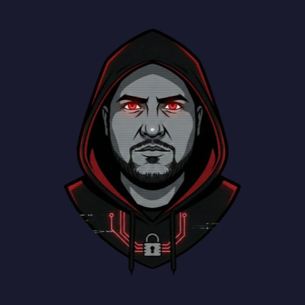
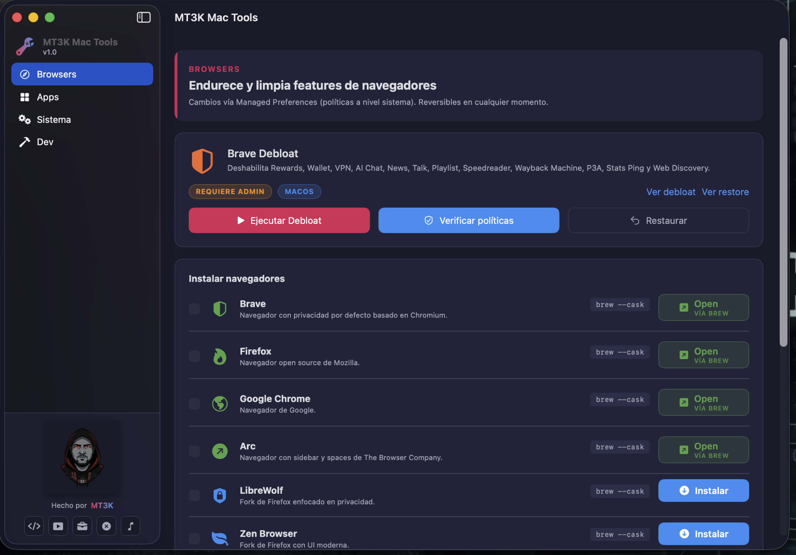

<p align="center">
  
</p>

<h1 align="center">MT3K Mac Tools</h1>

<p align="center">
  A native macOS setup utility for installing apps, managing developer tools, and applying opinionated Mac tweaks.
</p>

<p align="center">
  
  
  
  
  <a href="https://www.patreon.com/MT3K"></a>
</p>

---

**MT3K Mac Tools** is a native SwiftUI app for setting up a Mac fast: install curated apps and CLIs, adopt existing apps into Homebrew, track Brew updates, and run admin-level browser hardening scripts from one clean interface.

Think **Chris Titus winutil**, but built for macOS, SwiftUI, Homebrew, and the way Mac power users actually work.

<p align="center">
  
</p>

## Download

- **🚀 Ready-to-run app (signed):** patrons ($5+) on [**Patreon**](https://www.patreon.com/MT3K) get the pre-built, code-signed `.app` for every release — first, before the public release — and support development at the same time.
- **🛠️ Build from source:** free forever. See [Build From Source](#build-from-source).

## What It Does

- Installs from a curated **174-item catalog** across Browsers, AI/Coding, Dev, Cybersecurity, Productivity, Design, Communication, Cloud, Utilities, and Media.
- Detects what is already installed through **Homebrew** and `/Applications`.
- Shows app states directly in the catalog:
  - `Instalar`
  - `Open / VIA BREW`
  - `Open / EN /APPLICATIONS`
  - `Instalar / VIA BREW` when adopting an existing app into Brew
  - `Actualizar` when Brew reports an update
- Supports sequential install queues with multi-select checkboxes.
- Includes setup presets like Developer base, AI coding, Security toolkit, and Creator.
- Streams install logs live from Brew/npm/curl.
- Handles `.pkg`-based casks by handing off to Terminal so sudo has a real TTY.
- Runs Brave Debloat/Restore through macOS Authorization Services with a session-long admin grant.
- **MT3K Flow**: native dictation with a global hotkey — local transcription via WhisperKit (offline) or cloud (Groq/OpenAI), optional cleanup with a local Ollama model, learned corrections, and paste-into-frontmost-app.
- **Battery Guard**: charge-limit control on Apple Silicon via a signed privileged helper that enforces the limit autonomously (SMC charge inhibit), even with the app closed.
- **Displays / Power / Stats / Ollama** panes: multi-display brightness & gamma, power management, a live system stats dashboard, and a local Ollama model manager.
- Menu bar suite: main popover with live CPU/GPU/RAM/disk/battery/Ollama status and quick toggles (Caffeine, Battery Guard), plus optional compact per-metric meters.
- Ships as a tiny native `.app` bundle, not a Chromium/webview monster.

## Highlights

### Native Mac App

Built with Swift 6, SwiftUI, AppKit, Security, IOKit, and Foundation. Two third-party Swift packages, each scoped to one feature: [WhisperKit](https://github.com/argmaxinc/WhisperKit) (local CoreML transcription for Flow) and [SMCKit](https://github.com/srimanachanta/SMCKit) (SMC access for the Battery Guard helper, pinned revision).

### Homebrew-Aware Catalog

MT3K understands the difference between:

- app exists in `/Applications`
- app is installed through Brew
- app has a Brew update available
- app needs Terminal because its cask contains a `.pkg`

That means it can open installed apps, install missing ones, upgrade outdated Brew packages, or adopt an existing `.app` into Brew with `--force`.

### Brave Debloat

The Browsers tab includes a Brave policy tool that disables noisy or unwanted Brave features:

- Rewards
- Wallet
- VPN
- AI Chat
- News
- Talk
- Playlist
- Speedreader
- Wayback Machine
- P3A
- Stats Ping
- Web Discovery

It writes managed preferences at the system level and includes a restore path.

### Installer Methods

The catalog supports:

| Method | Example | Notes |
|---|---|---|
| Homebrew cask | `brew install --cask firefox` | GUI apps |
| Homebrew formula | `brew install git` | CLI tools |
| Brew tap | `brew install pear-devs/pear/pear-desktop` | External taps |
| npm global | `npm install -g @pencil.dev/cli` | JS CLIs |
| Direct DMG | Architecture-aware download | Uses `hdiutil` |
| GitHub latest | Release asset resolver | Regex-based asset matching |

## Included Examples

The catalog includes tools like:

- Browsers: Brave, Firefox, Chrome, Arc, LibreWolf, Zen, Opera
- AI/Coding: Claude, Codex Desktop, Codex CLI, Claude Code, Ollama, LM Studio, Cursor, Windsurf, Zed, Pear Desktop
- Dev: Git (Homebrew), Node.js, GitHub CLI, OrbStack, iTerm2, Ghostty, tmux, Fish
- Cybersecurity: Wireshark, Burp Suite CE, OWASP ZAP, Proxyman, nmap, ffuf, sqlmap, hashcat
- Productivity: Notion, Obsidian, Linear, Logseq, Craft, LibreOffice
- Utilities: Raycast, Rectangle, Stats, Latest, Caffeine, Keka, AppCleaner, Windows App
- Media: VLC, IINA, Moonlight, Spotify, OBS, GeForce Now

## Build From Source

Requirements:

- macOS 14 or newer
- Xcode Command Line Tools
- Swift 6 toolchain

Clone and build:

```bash
git clone https://github.com/MondoBoricua/MT3K-Mac-Tools.git
cd MT3K-Mac-Tools
swift build
```

Run from SwiftPM:

```bash
swift run
```

Build a proper `.app` bundle:

```bash
./bundle.sh release
open "dist/MT3K Mac Tools.app"
```

Debug bundle:

```bash
./bundle.sh debug
```

## Distribution Note

`bundle.sh` signs with a **Developer ID Application** certificate when one exists in the Keychain (hardened runtime + timestamp, helper signed with its own identifier), and falls back to ad-hoc signing otherwise. If a `notarytool` keychain profile named `mt3k-notary` exists, it also notarizes and staples the bundle automatically; without it, the app remains signed but unnotarized.

## Architecture

```text
MT3KMacToolsApp
├─ ContentView              Sidebar navigation
├─ BrowsersView             Brave Debloat/Restore + browser installs
├─ AppsView                 Catalog dashboard, filters, presets, queue
├─ DevView / SystemView     Dev health checks + reversible system tweaks
├─ Flow*                    Dictation: state, hotkey, local/cloud engines, HUD
├─ BatteryGuardView         Charge-limit UI over the privileged helper
├─ DisplayManagementView    Multi-display brightness/gamma
├─ StatsDashboard           Live system stats (shared StatsParsers)
├─ MenuBar*                 Bridge, main popover, compact metric meters
├─ OllamaPanel              Local Ollama model manager
├─ InstallCoordinator       Shared install/update/queue state
├─ BrewState                Brew/node/install/update detection
├─ AdminAuth                Authorization Services wrapper
├─ ScriptRunner             Process execution + script discovery
├─ Catalog                  Static app catalog
├─ Sources/BatteryGuardCore Pure guard decision logic (shared with tests)
├─ Sources/MT3KBatteryHelper  Root daemon: SMC writes + autonomous limit
└─ scripts/
   ├─ install_package.sh    Generic package dispatcher
   ├─ install_brew.sh       Homebrew installer handoff
   ├─ brave_debloat.sh      Managed Preferences writer
   └─ brave_restore.sh      Brave policy cleanup
```

## Testing

Unit tests (Swift Testing) cover the pure logic: catalog integrity, stats/battery parsers, Flow text cleanup, Ollama Cloud detection, and — most importantly — the Battery Guard daemon's decision logic:

```bash
swift test
```

CI runs `swift build` + `swift test` on every push via GitHub Actions.

## Why Native?

This project started as Electron, moved to Tauri, and landed on SwiftUI.

| Version | Stack | Result |
|---|---|---|
| Electron | Chromium + Node | Worked, but huge |
| Tauri 2 | Rust + WebView | Smaller, still web UI |
| SwiftUI | Native macOS | Tiny, fast, Mac-native |

The current app is a native Mac utility with native dialogs, menus, sheets, authorization, and window behavior.

## Safety Model

MT3K does not pass arbitrary user input into install scripts.

- Installable packages are defined in `Catalog.swift`.
- Admin scripts are bundled and resolved by name.
- Homebrew installs run as the current user, never as root.
- Admin scripts use macOS Authorization Services.
- `.pkg`-backed casks use Terminal handoff for a real sudo prompt.

## Common Commands

```bash
swift build
swift run
./bundle.sh release
open "dist/MT3K Mac Tools.app"
pkill -f "MT3K Mac Tools"
```

## Roadmap Ideas

- Public signed/notarized release
- Dedicated screenshot gallery
- More system tweak modules
- Dotfiles/bootstrap workflows
- Better CLI-only installed state UI
- Version comparison for direct DMG and GitHub-release apps
- Export/import install presets

## Support on Patreon

MT3K Mac Tools is free and open source. If it saves you time setting up a
Mac, consider supporting development on [Patreon](https://www.patreon.com/MT3K).

Patrons ($5+) get **signed pre-built releases early** (before the public
notarized release lands) and a voice in the roadmap.

## License

MIT — see [LICENSE](LICENSE).

---

Built by **MT3K** for people who would rather configure a Mac once and get back to building.
